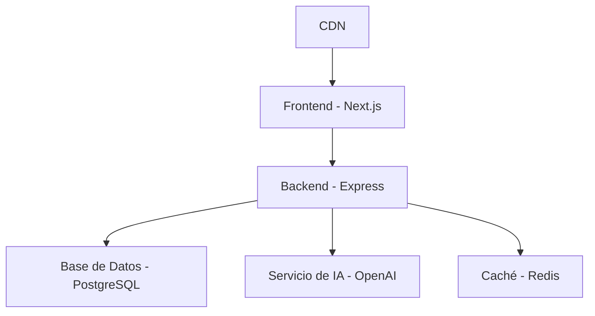
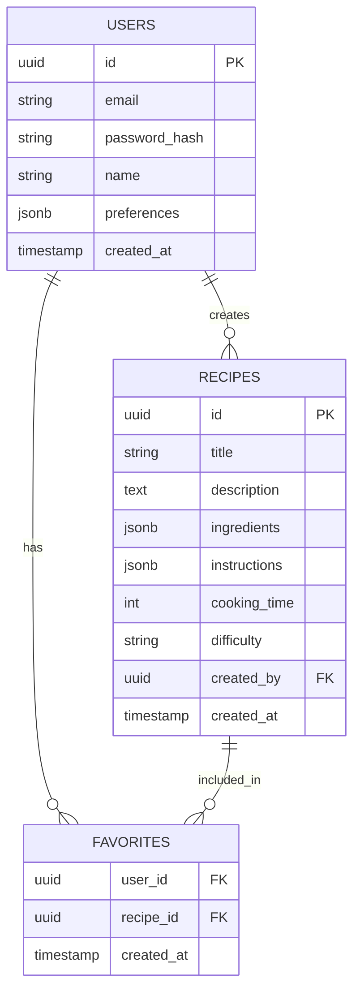

# Documentación del Proyecto - Asistente de Recetas Inteligente

## Índice

0. [Ficha del proyecto](#0-ficha-del-proyecto)
1. [Descripción general del producto](#1-descripción-general-del-producto)
2. [Arquitectura del sistema](#2-arquitectura-del-sistema)
3. [Modelo de datos](#3-modelo-de-datos)
4. [Especificación de la API](#4-especificación-de-la-api)
5. [Historias de usuario](#5-historias-de-usuario)
6. [Tickets de trabajo](#6-tickets-de-trabajo)
7. [Pull requests](#7-pull-requests)

---

## 0. Ficha del proyecto

### **0.1. Tu nombre completo:**
[Tu nombre]

### **0.2. Nombre del proyecto:**
Asistente de Recetas Inteligente

### **0.3. Descripción breve del proyecto:**
Sistema inteligente que utiliza IA para ayudar a los usuarios a encontrar, crear y gestionar recetas de cocina de manera personalizada, ofreciendo recomendaciones basadas en preferencias y restricciones dietéticas.

### **0.4. URL del proyecto:**
[URL del proyecto]

### **0.5. URL o archivo comprimido del repositorio**
[URL del repositorio]

---

## 1. Descripción general del producto

### **1.1. Objetivo:**
El objetivo principal es proporcionar una solución inteligente que ayude a los usuarios a:
- Encontrar recetas basadas en ingredientes disponibles
- Generar recetas personalizadas según preferencias dietéticas
- Analizar el valor nutricional de las recetas
- Gestionar una colección personal de recetas favoritas
- Recibir recomendaciones inteligentes basadas en el historial de uso

### **1.2. Características y funcionalidades principales:**
1. **Búsqueda Inteligente de Recetas**
   - Búsqueda por ingredientes
   - Filtrado por restricciones dietéticas
   - Búsqueda semántica de recetas

2. **Generación de Recetas con IA**
   - Creación de recetas basadas en ingredientes disponibles
   - Adaptación de recetas según preferencias
   - Generación de instrucciones paso a paso

3. **Análisis Nutricional**
   - Cálculo de valores nutricionales
   - Identificación de alergenos
   - Sugerencias de sustitutos

4. **Gestión Personal**
   - Perfil de usuario con preferencias
   - Colección de recetas favoritas
   - Historial de búsquedas

### **1.3. Diseño y experiencia de usuario:**
[Incluir capturas de pantalla y/o videotutorial]

### **1.4. Instrucciones de instalación:**
```bash
# Clonar el repositorio
git clone https://github.com/brandonecheverry/AI4Devs-finalproject.git

# Instalar dependencias del backend
cd backend
npm install
cp .env.example .env
# Configurar variables de entorno
npm run migrate
npm run seed

# Instalar dependencias del frontend
cd ../frontend
npm install
cp .env.example .env
# Configurar variables de entorno

# Iniciar el proyecto
# Terminal 1 (Backend)
cd backend
npm run dev

# Terminal 2 (Frontend)
cd frontend
npm run dev
```

---

## 2. Arquitectura del Sistema

### **2.1. Diagrama de arquitectura:**


### **2.2. Descripción de componentes principales:**
1. **Frontend (Next.js)**
   - Interfaz de usuario moderna y responsiva
   - Gestión de estado con Zustand
   - Estilizado con TailwindCSS
   - Optimización de rendimiento con React Query

2. **Backend (Express)**
   - API RESTful
   - Autenticación JWT
   - ORM con Prisma
   - Integración con OpenAI

3. **Base de Datos (PostgreSQL)**
   - Almacenamiento persistente
   - Relaciones complejas
   - Soporte JSON para datos flexibles

4. **Servicio de IA (OpenAI)**
   - GPT-4 para generación de recetas
   - Embeddings para búsqueda semántica
   - Clasificador para categorización

### **2.3. Descripción de alto nivel del proyecto y estructura de ficheros:**
```
/
├── frontend/                 # Aplicación Next.js
│   ├── components/          # Componentes reutilizables
│   ├── pages/              # Rutas y páginas
│   ├── styles/             # Estilos globales
│   └── utils/              # Utilidades y helpers
├── backend/                 # API Express
│   ├── controllers/        # Controladores
│   ├── models/            # Modelos de datos
│   ├── routes/            # Rutas API
│   └── services/          # Servicios de negocio
├── docs/                   # Documentación
└── tests/                 # Tests automatizados
```

### **2.4. Infraestructura y despliegue:**
- **Desarrollo:**
  - Docker para contenedores
  - Docker Compose para orquestación local

- **Producción:**
  - Kubernetes para orquestación
  - CI/CD con GitHub Actions
  - CDN para assets estáticos

### **2.5. Seguridad:**
1. **Autenticación y Autorización**
   - JWT con refresh tokens
   - Rate limiting por IP
   - Validación de datos

2. **Protección de Datos**
   - Encriptación de datos sensibles
   - Sanitización de inputs
   - Protección contra XSS

3. **Monitoreo**
   - Logging centralizado
   - Detección de anomalías
   - Auditoría de seguridad

### **2.6. Tests:**
1. **Frontend**
   - Jest para unit testing
   - Cypress para E2E
   - Storybook para componentes

2. **Backend**
   - Jest para unit testing
   - Supertest para API testing
   - Prisma Mock para DB testing

---

## 3. Modelo de Datos

### **3.1. Diagrama del modelo de datos:**


### **3.2. Descripción de entidades principales:**
1. **Users**
   - Almacena información de usuarios
   - Preferencias en formato JSON
   - Relación 1:N con Recipes

2. **Recipes**
   - Almacena recetas completas
   - Ingredientes e instrucciones en JSON
   - Relación N:M con Users (favoritos)

3. **Favorites**
   - Tabla de unión para favoritos
   - Claves compuestas user_id y recipe_id

---

## 4. Especificación de la API

### Generación de Recetas
```yaml
POST /api/ai/generate-recipe
description: Genera una nueva receta basada en ingredientes y preferencias
requestBody:
  content:
    application/json:
      schema:
        type: object
        properties:
          ingredients:
            type: array
            items:
              type: string
          preferences:
            type: object
            properties:
              dietary:
                type: array
                items:
                  type: string
              allergies:
                type: array
                items:
                  type: string
              cookingTime:
                type: number
              difficulty:
                type: string
                enum: [easy, medium, hard]
          servings:
            type: number
responses:
  '200':
    description: Receta generada exitosamente
    content:
      application/json:
        schema:
          $ref: '#/components/schemas/Recipe'
```

---

## 5. Historias de Usuario

### Historia de Usuario 1
**Como** usuario que quiere cocinar con ingredientes disponibles  
**Quiero** generar una receta basada en mis ingredientes  
**Para** aprovechar lo que tengo en casa sin desperdiciar comida

**Criterios de Aceptación:**
- Puedo ingresar mis ingredientes disponibles
- Puedo especificar mis preferencias dietéticas
- Recibo una receta completa con instrucciones
- La receta incluye información nutricional

### Historia de Usuario 2
**Como** usuario con restricciones dietéticas  
**Quiero** encontrar recetas que se ajusten a mis necesidades  
**Para** mantener una alimentación saludable y segura

**Criterios de Aceptación:**
- Puedo especificar mis restricciones dietéticas
- El sistema filtra recetas según mis restricciones
- Recibo alternativas para ingredientes problemáticos
- Se muestran advertencias de alergenos

### Historia de Usuario 3
**Como** usuario que quiere mejorar sus habilidades culinarias  
**Quiero** recibir recomendaciones personalizadas  
**Para** aprender nuevas recetas y técnicas

**Criterios de Aceptación:**
- El sistema analiza mi historial de recetas
- Recibo recomendaciones basadas en mis preferencias
- Las recomendaciones incluyen nivel de dificultad
- Puedo guardar recetas para practicar después

---

## 6. Tickets de Trabajo

### Ticket 1: Implementación de Autenticación
**Tipo:** Backend
**Prioridad:** Alta
**Descripción:**
Implementar sistema de autenticación JWT con refresh tokens

**Tareas:**
1. Crear endpoints de registro y login
2. Implementar middleware de autenticación
3. Configurar refresh tokens
4. Implementar validación de datos
5. Añadir tests unitarios

### Ticket 2: Desarrollo de Interfaz de Búsqueda
**Tipo:** Frontend
**Prioridad:** Alta
**Descripción:**
Crear interfaz de búsqueda de recetas con filtros avanzados

**Tareas:**
1. Diseñar componente de búsqueda
2. Implementar filtros dinámicos
3. Integrar con API de búsqueda
4. Añadir animaciones y feedback
5. Implementar tests E2E

### Ticket 3: Optimización de Base de Datos
**Tipo:** Base de Datos
**Prioridad:** Media
**Descripción:**
Optimizar consultas y estructura de la base de datos

**Tareas:**
1. Analizar consultas lentas
2. Crear índices necesarios
3. Optimizar esquema de datos
4. Implementar caché con Redis
5. Documentar optimizaciones

---

## 7. Pull Requests

### Pull Request 1: Implementación de Autenticación
**Descripción:**
Implementación del sistema de autenticación con JWT

**Cambios principales:**
- Nuevos endpoints de autenticación
- Middleware de verificación
- Tests unitarios
- Documentación actualizada

### Pull Request 2: Integración con OpenAI
**Descripción:**
Integración del servicio de IA para generación de recetas

**Cambios principales:**
- Servicio de OpenAI
- Prompts optimizados
- Manejo de errores
- Tests de integración

### Pull Request 3: Optimización de Rendimiento
**Descripción:**
Mejoras de rendimiento en frontend y backend

**Cambios principales:**
- Implementación de caché
- Optimización de consultas
- Lazy loading de componentes
- Métricas de rendimiento 